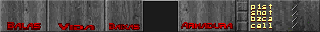
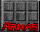

# Tradução PT-BR para Doom (WAD modificado)

Este projeto é uma tradução completa da interface e elementos textuais do jogo *Doom* original para o português brasileiro, realizada diretamente no arquivo WAD original. A intenção é manter a estética clássica do jogo enquanto adapta a experiência para falantes nativos de português.

Mod disponível também diretamente da aba "mods" da re-release DOOM DOOMII na kex engine , procure por "Doom em PT".

## 📦 Sobre o Projeto

Esta tradução modifica diretamente os gráficos e textos embutidos no WAD original, garantindo uma experiência localizada sem alterar a jogabilidade clássica do Doom. O projeto inclui traduções para:

- HUD e menus
- Itens e armas
- Mensagens do sistema
- Configurações (como sensibilidade do mouse)
- Nomes de áreas e seleções de episódio (quando aplicável)

## 🖼️ Exemplos Visuais

Abaixo, alguns exemplos das telas traduzidas:

### HUD e Menu Principal

### Tela de Seleção de Armas

### Configuração de Sensibilidade do Mouse

## 📄 Licença

Este projeto é um trabalho de fãs sem fins lucrativos. O Doom original é propriedade da id Software. Este mod deve ser utilizado apenas com cópias legítimas do jogo.

## ✍️ Créditos

Tradução, edição gráfica e adaptação por **[Spet]**  
Ferramentas utilizadas: SLADE, GIMP
